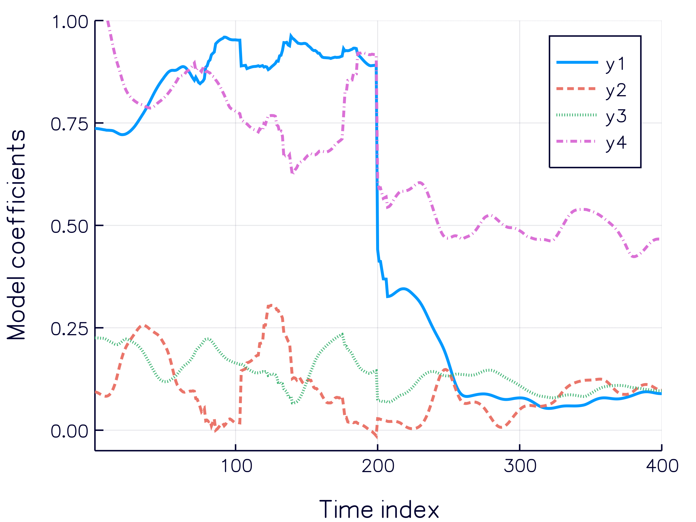
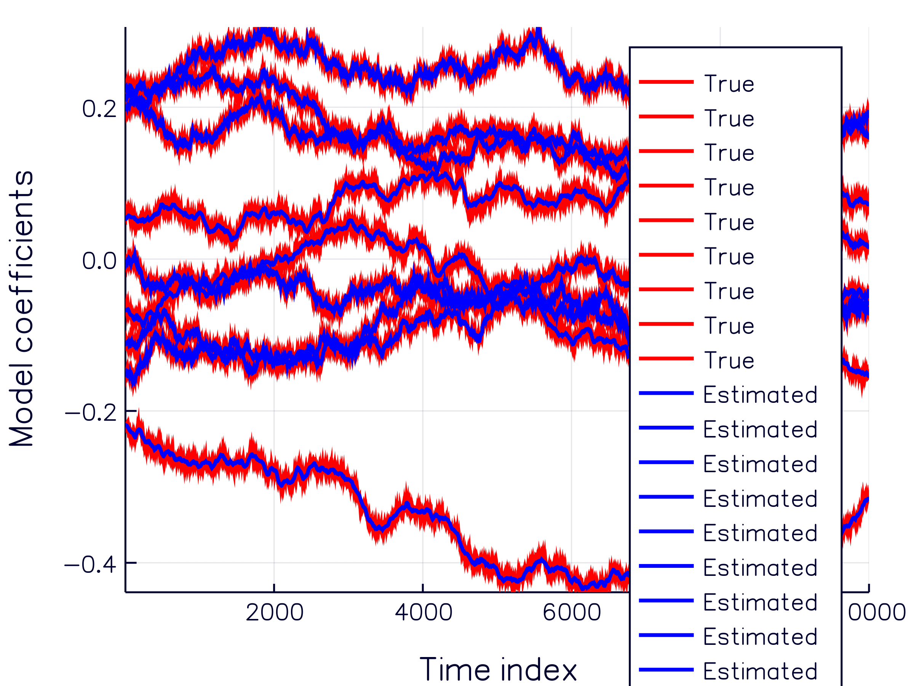

# LTVModels

[](https://travis-ci.org/baggepinnen/LTVModels.jl)
[](https://coveralls.io/github/baggepinnen/LTVModels.jl?branch=master)
[](https://codecov.io/gh/baggepinnen/LTVModels.jl)


2018-03-14: More documentation and instructions to appear shortly. If you want to use this package before documentation is complete, feel free to open an issue and I'll help you out.

This repository implements the system-identification methods presented in  
[Bagge Carlson, F.](https://www.control.lth.se/staff/fredrik-bagge-carlson/), Robertsson, A. & Johansson, R. ["Identification of LTV Dynamical Models with Smooth or Discontinuous Time Evolution by means of Convex Optimization"](https://arxiv.org/abs/1802.09794) (IEEE ICCA 2018).
[Bagge Carlson, F.](https://www.control.lth.se/staff/fredrik-bagge-carlson/), ["Machine Learning and System Identification for Estimation in Physical Systems"](https://lup.lub.lu.se/search/publication/ffb8dc85-ce12-4f75-8f2b-0881e492f6c0) (PhD Thesis 2018).
```bibtex
@thesis{bagge2018,
  title        = {Machine Learning and System Identification for Estimation in Physical Systems},
  author       = {Bagge Carlson, Fredrik},
  keyword      = {Machine Learning,System Identification,Robotics,Spectral estimation,Calibration,State estimation},
  month        = {12},
  type         = {PhD Thesis},
  number       = {TFRT-1122},
  institution  = {Dept. Automatic Control, Lund University, Sweden},
  year         = {2018},
  url          = {},
}
```


# Installation
```julia
Pkg.add("https://github.com/baggepinnen/LinearTimeVaryingModelsBase.jl")
Pkg.add("https://github.com/baggepinnen/LTVModels.jl")
using LTVModels
```

# Usage
Usage of many of the functions is demonstrated in `tests/runtests.jl`

To fit a model by solving  
minimize ||y-ŷ||² + λ²||Dₓ k||  
and to reproduce Fig. 1 in the paper
```julia
using LTVModels, Plots
gr(size=(400,300))
T_       = 400
x,xm,u,n,m = LTVModels.testdata(T_)

anim = Plots.Animation()
function callback(m)
    fig = plot(flatten(m.At), l=(2,:auto), xlabel="Time index", ylabel="Model coefficients", show=true, ylims=(-0.05, 1))
    frame(anim, fig)
end

λ = 17
@time model = LTVModels.fit_statespace_admm(xm, u, λ, extend=true,
                                                iters    = 10000,
                                                D        = 1,
                                                zeroinit = true,
                                                tol      = 1e-5,
                                                ridge    = 0,
                                                cb       = callback)
gif(anim, "admm.gif", fps = 10)
y = predict(model,x,u)
e = x[:,2:end] - y[:,1:end-1]
println("RMS error: ",rms(e))

At,Bt = model.At,model.Bt
plot(flatten(At), l=(2,:auto), xlabel="Time index", ylabel="Model coefficients")
plot!([1,T_÷2-1], [0.95 0.1; 0 0.95][:]'.*ones(2), l=(:dash,:black, 1))
plot!([T_÷2,T_], [0.5 0.05; 0 0.5][:]'.*ones(2), l=(:dash,:black, 1), grid=false)
gui()
```


The animation shows the estimated model coefficients `k[t] = A[t],B[t]` as a function of time `t` converge as the optimization procedure is running. The final result is Fig. 1 in the paper.

## Fit model using Kalman smoother
Code to fit a model by solving (7) using a Kalman smoother:

The code generates an LTV model `A[t], B[t]` and time series `x,u` governed by the model. A model is then fit using a Kalman smoother and the true model coefficients as well as the estimated are plotted. The gif below illustrates how the choice of covariance parameter influences the estimated time-evolution of the model parameters. As `R2`→∞, the result approaches that of standard least-squares estimation of an LTI model.
```julia
using LTVModels, Plots, LinearAlgebra
T = 2_000
A,B,x,u,n,m,N = LTVModels.testdata(T=T, σ_state_drift=0.001, σ_param_drift=0.001)

gr(size=(400,300))
eye(n) = Matrix{Float64}(I,n,n)
anim = @animate for r2 = exp10.(range(-3, stop=3, length=10))
    R1          = 0.001*eye(n^2+n*m)
    R2          = r2*eye(n)
    P0          = 10000R1
    model = KalmanModel(copy(x),copy(u),R1,R2,P0,extend=true)

    plot(flatten(A), l=(2,), xlabel="Time index", ylabel="Model coefficients", lab="True", c=:red)
    plot!(flatten(model.At), l=(2,), lab="Estimated", c=:blue, legend=false)
end
gif(anim, "kalman.gif", fps = 5)

```



## Dynamic programming solver
To solve the optimization problem in section IID, see the function `fit_statespace_dp` with usage example in the function [`benchmark_ss`](https://github.com/baggepinnen/LTVModels.jl/blob/master/src/seg_bellman.jl#L183)


## Two-step procedure
See functions in files `peakdetection.jl` and function `fit_statespace_constrained`

## Figs. 2-3
The simulation of the two-link robot presented in figures 2-3 in the paper is generated using the code in [`two_link.jl`](https://github.com/baggepinnen/LTVModels.jl/blob/master/examples/two_link.jl)

## Fig. 4
To appear

[DifferentialDynamicProgramming.jl](https://github.com/baggepinnen/DifferentialDynamicProgramming.jl/tree/dev)

## LTI estimation
Estimation of standard LTI systems is provided by [ControlSystemIdentification.jl](https://github.com/baggepinnen/ControlSystemIdentification.jl) 
